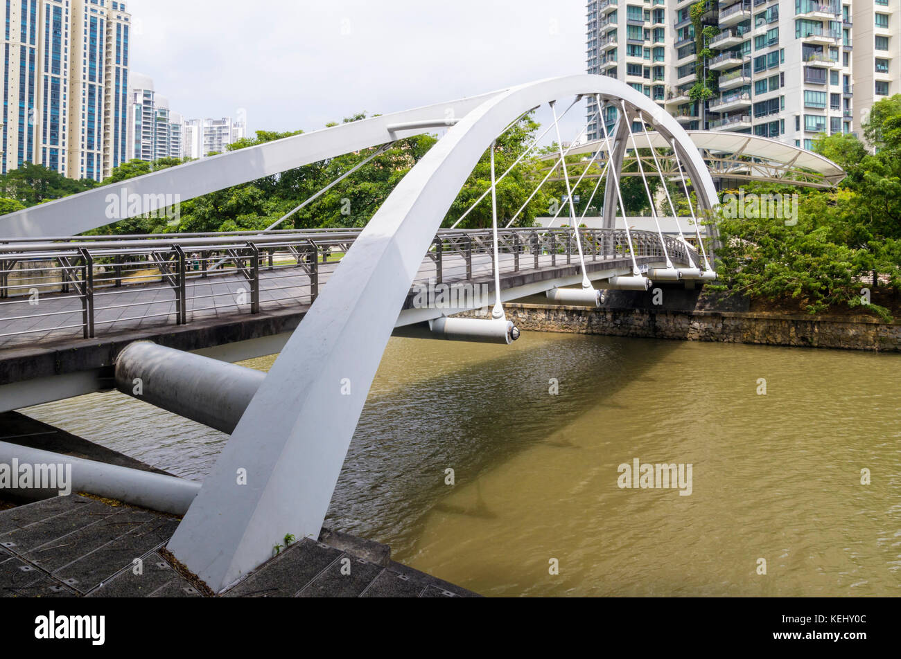
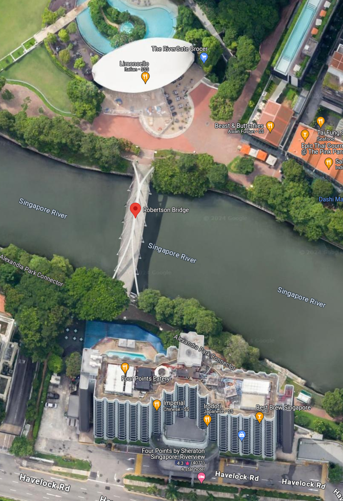

> Original Writeup on [seall.dev](https://seall.dev/posts/downunderctf2024#bridget-lives)

We are supplied a `bridget.png`.

Due to the unique shape of the bridge I put it into Google Images. After some scrolling and some similar-ish bridges but a different background, I find a match.

The Robertson Bridge, Singapore is the one!

We can see the circle foyer in the background of the original image, meaning the photo had to be taken from **Four Points**.

Flag: `DUCTF{four_points}`