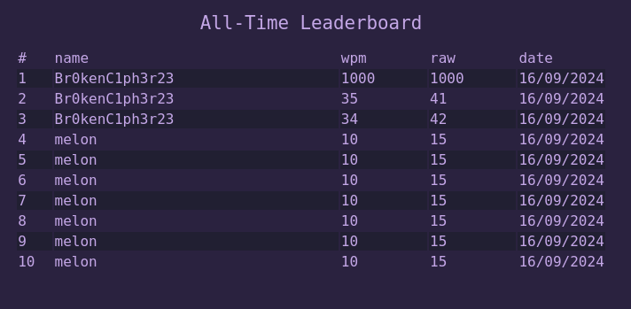

> Original Writeup on [seall.dev](https://seall.dev/posts/seceduweek32024#score)

Visiting the site, we are shown a typing test!


There is also a leaderboard and a login page.



We try the credentials for `Br0kenC1ph3r23` on the login page and it works! (We later find out as long as the username is not taken the password doesn't matter...)

Ok, we have a login, let's try this test and see if we can mess with the score!

```
POST /api/score HTTP/1.1
Host: chals.secedu.site:5007
Content-Length: 120
...
{"score":"⏝⎄⏑⏖⏋⎄⎜⎒⎔⎈⎔⎖⎖⎖⎖⎖⎖⎖⎖⎖⎖⎖⎖⎗⎊⎄⏔⏇⏑⎄⎜⎑⎑⎈⎒⏛"}
```

Huh..?

Some kind of weird character encoding, let's check out the JS source code of the site.

Doing some digging I find a [JS file](http://chals.secedu.site:5007/_app/immutable/nodes/2.B-bCw-im.js) with a segment of interest:
```js
const dt = (s, e) => {
        Te.set(s), Qe.set(e), qe.set(s * e), pt()
    },
    mt = () => JSON.stringify({
        wpm: f(qe),
        raw: f(Te)
    }).split("").map(e => e.charCodeAt(0)).map(e => e ^ 4401 ^ 5556 ^ 10019).map(e => String.fromCharCode(e)).join(""),
    pt = async () => {
        const s = await et("score", "POST", {
            score: mt()
        });
        s.success ? Ce.set(s.rank) : Ce.set(-1)
    }, Se = b(!1), ht = () => {
        Se.set(!1), $e(), ot()
    }, vt = () => {
        const s = D.length,
            a = f(F).reduce((n, t) => n + f(t).reduce((r, c) => r + +(c === !1), 0), 0) / s,
            l = s / 5;
        dt(l * (60 / xe), a), Se.set(!0)
    };
```

It seems to be doing some whacky XOR operation, let's make a quick decryption and encryption script for modification of the values.

```js
function decodeInput(output) {
    const decodedChars = output.split("").map(decodeChar);
    return decodedChars.join("");
}
function decodeChar(char) {
    return String.fromCharCode(char.charCodeAt(0) ^ 4401 ^ 5556 ^ 10019);
}
function encodeInput(input) {
    const encodedChars = input.split("").map(encodeChar);
    return encodedChars.join("");
}
function encodeChar(char) {
    return String.fromCharCode(char.charCodeAt(0) ^ 4401 ^ 5556 ^ 10019);
}
```

Loading those functions into the console, I try to `decodeInput()` my POST request data:
```js
> decodeInput("⏝⎄⏑⏖⏋⎄⎜⎒⎔⎈⎔⎖⎖⎖⎖⎖⎖⎖⎖⎖⎖⎖⎖⎗⎊⎄⏔⏇⏑⎄⎜⎑⎑⎈⎒⏛")
'{"wpm":42.20000000000001,"raw":77.4}' 
```

Great! Let's try making that WPM and RAW values 100!

```js
> encodeInput('{"wpm":1000.0,"raw":1000.0}')
"⏝⎄⏑⏖⏋⎄⎜⎗⎖⎖⎖⎈⎖⎊⎄⏔⏇⏑⎄⎜⎗⎖⎖⎖⎈⎖⏛"
```

Sending that in the POST request we just get first on the leaderboard but no flag... What if we overload it with a lot of `9`'s?

```js
> encodeInput('{"wpm":99999999999999999999999999999999999999999999999999999999999999999999999999999999999999999999999999999999999999999999999999999999999.99,"raw":99999999999999999999999999999999999999999999999999999999999999999999999999999999999999999999999999999999999999999999999999999999999.99}')
"⏝⎄⏑⏖⏋⎄⎜⎟⎟⎟⎟⎟⎟⎟⎟⎟⎟⎟⎟⎟⎟⎟⎟⎟⎟⎟⎟⎟⎟⎟⎟⎟⎟⎟⎟⎟⎟⎟⎟⎟⎟⎟⎟⎟⎟⎟⎟⎟⎟⎟⎟⎟⎟⎟⎟⎟⎟⎟⎟⎟⎟⎟⎟⎟⎟⎟⎟⎟⎟⎟⎟⎟⎟⎟⎟⎟⎟⎟⎟⎟⎟⎟⎟⎟⎟⎟⎟⎟⎟⎟⎟⎟⎟⎟⎟⎟⎟⎟⎟⎟⎟⎟⎟⎟⎟⎟⎟⎟⎟⎟⎟⎟⎟⎟⎟⎟⎟⎟⎟⎟⎟⎟⎟⎟⎟⎟⎟⎟⎟⎟⎟⎟⎟⎟⎟⎟⎟⎟⎈⎟⎟⎊⎄⏔⏇⏑⎄⎜⎟⎟⎟⎟⎟⎟⎟⎟⎟⎟⎟⎟⎟⎟⎟⎟⎟⎟⎟⎟⎟⎟⎟⎟⎟⎟⎟⎟⎟⎟⎟⎟⎟⎟⎟⎟⎟⎟⎟⎟⎟⎟⎟⎟⎟⎟⎟⎟⎟⎟⎟⎟⎟⎟⎟⎟⎟⎟⎟⎟⎟⎟⎟⎟⎟⎟⎟⎟⎟⎟⎟⎟⎟⎟⎟⎟⎟⎟⎟⎟⎟⎟⎟⎟⎟⎟⎟⎟⎟⎟⎟⎟⎟⎟⎟⎟⎟⎟⎟⎟⎟⎟⎟⎟⎟⎟⎟⎟⎟⎟⎟⎟⎟⎟⎟⎟⎟⎟⎟⎟⎟⎟⎟⎟⎟⎟⎟⎟⎟⎟⎟⎈⎟⎟⏛"
```

Sending that we get a better response:
```json
{"status":"SECEDU{definitely_not_a_robot}","success":true}
```

Flag: `SECEDU{definitely_not_a_robot}`