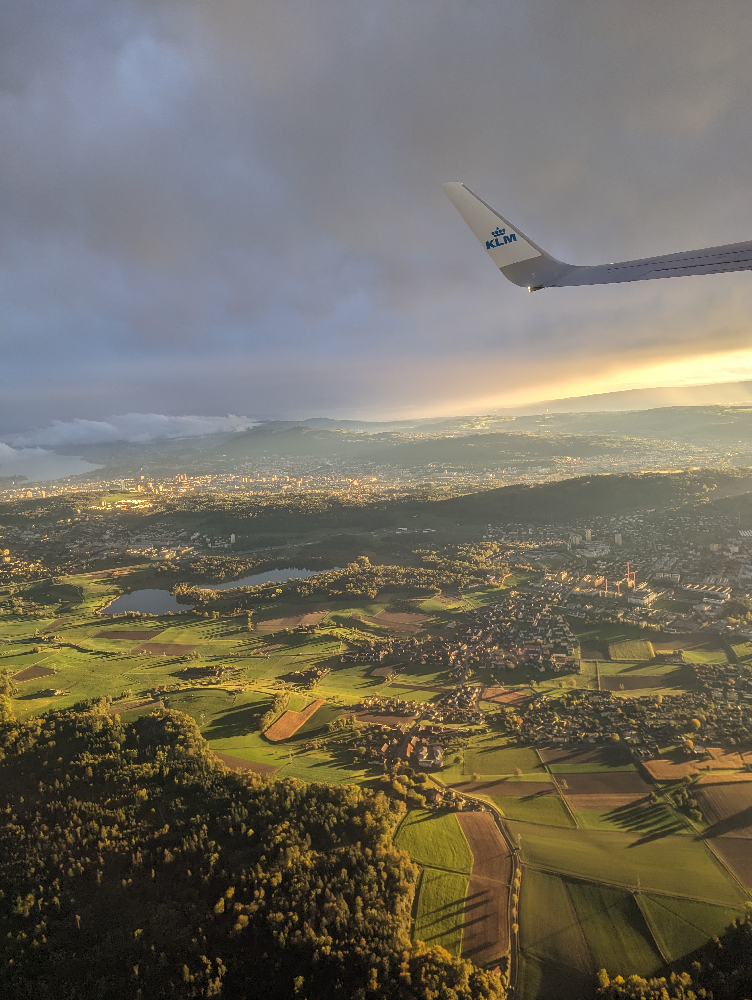

> Original Writeup on [seall.dev](https://seall.dev/posts/seceduweek42024#in_flight_entertainment)

This challenge we got close to but missed some pieces, we are given a photo of an airborne plane:

We can extract some crucial information from the photo:
- It's on an airline `KLM`
- The flaps are down, and the plane is low altitude, so likely taking off from the runway and were above a major city
- The photo was taken at 5:50pm on the 20th of October 2024
- It was taken in the CEST timezone, so likely in Europe somewhere

Already some good information! Using [GeoSpy.ai](https://geospy.ai) we identified the city below as Zurich!

We tried looking for many flights with various Google dorks but never found the right one, here was the solution as shared by another MQCybersec Team: JKVM!

- They presumed it was likely Zurich to Amsterdam, as it's a common route for this airline. Airlines typically fly to and from their main country.
- Flight tracking websites generally have a limited range of data for historical, so Googling had *mostly* nothing.
- [This site](https://www.flightera.net/route/LSZH/EHAM/2023-10-20%20%2005_00) allowed for time lookup's of a particular route (LZSH to EHAM).
- Flight `KL1962` was the correct plane.

My personal problem I had with this challenge was the stiff attempts limit, and we also just didn't find this site so... skill issue :')

Flag: `KL1962`