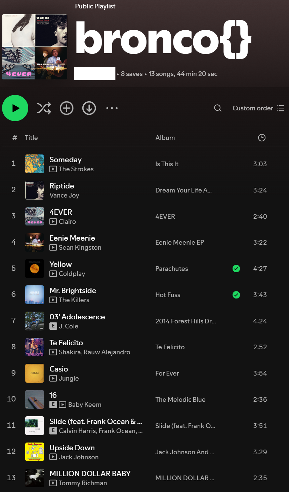

## At Least It's Not Pandora

In the CTF, we are provided with the following link to a Spotify playlist: 
https://open.spotify.com/playlist/3UD6tVsCoVqal5BgXug19m?go=1&sp_cid=a0f9926371de38e180f302dedf1df658&nd=1&dlsi=3f0850ce261f4c27

Here's a screenshot just in case the link doesnt work!

Once we access this link, we can see that it's called `bronco{}`, so that's a pretty good sign that we are on the right path! 

If we look at the first letter of each song, we can see it doesn't really make anything ledgible. However, if we start at the last song and work our way back up (which matches the `My taste in music used to be so backwards` statement), we get something in leetspeak, which happens to be the flag!

Flag: `bronco{MUS1CT0MYE4RS}`

