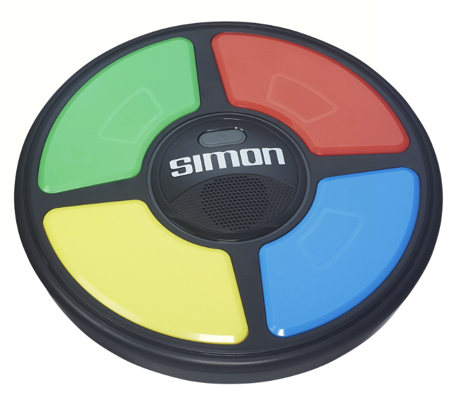
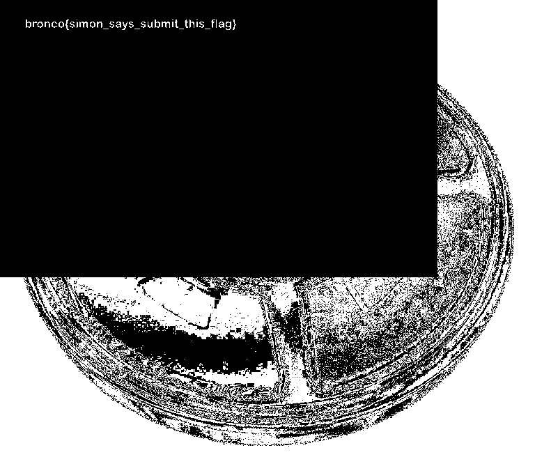

## Simon Says 

To start this challenge off, we are provided with the following image. 

Personally, I love stego challenges, so the instant I saw the image, and the the fact that the challenge description referenced blue, I thought of the different colour channels used to make images. I then uploaded the challenge `.png` file to AperiSolve. After extracting the image found in the third blue channel, I found this: 

That looks like the flag to me!

Flag: `bronco{simon_says_submit_this_flag}`