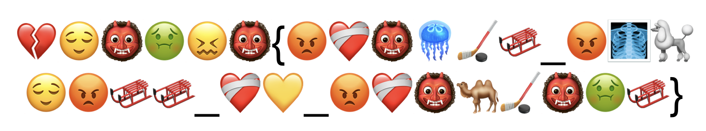

## Too Many Emojis

To start, we are provided with the following image: 

From this image, we can see that we are provided with the flag format. By crosschecking the flag format `bronco{}` and the first group of emojis, we can see that the first letter of each emoji is used to make the flag! So:

|Emoji   |Emoji Name|Letter Taken|
|---------|----------|------------|
|💔   |Broken Heart  | `b`     |
|😌   |Relieved Face | `r`     |
|👹   |Ogre          | `o`     |
|🤢   |Nauseated Face | `n`    |
|😖   |Confounded Face | `c`   |
|👹   |Ogre          | `o`     |

With that, we can get the flag!

Flag: `bronco{emojis_express_my_emotions}`