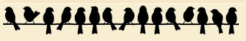

## Challenge

The challenge provides us with an image of birds on a rope and asks us to decipher the message.

Reverse searching this image on Google mentions the **birds on a wire cipher**. This website can be used to encrypt and decrypt messages for this cipher https://www.dcode.fr/birds-on-a-wire-cipher.

Decrypting the ciphertext, we get the message: `THEREISNOESCAPE`

Flag: `DawgCTF{there_is_no_escape}`
