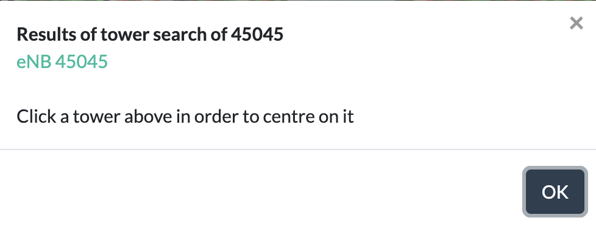
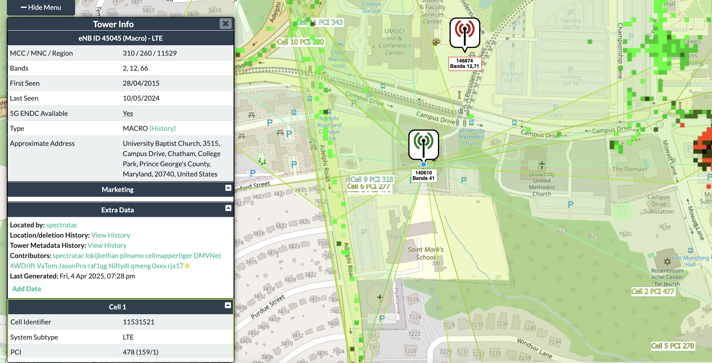

Firstly, what's a [Rayhunter](https://github.com/EFForg/rayhunter)?

As best explained by their repo:
> Rayhunter is an IMSI Catcher-Catcher for the Orbic mobile hotspot.

For the flag format we need 3 parts of information:
- The IMSI
- The IMEI
- The zip code of the catcher-catcher

## The IMSI

We can the IMSI from exploring the supplied pcap in Wireshark.

It's visible inside packet 28 in the (NAS)PDU section of the packet dissector.

Easy enough, let's do the rest!

## The zip code

Generally the zip code is not going to be transmitted, but the tower locations might!

To properly search the tower we need a few values
- Cell ID
- MCC
- MNC

A service like CellMapper can do this.

We can use this Wireshark filter to get connectivity requests and data blocks containing the relevant information: `nas-eps.nas_msg_emm_type == 0x41 || lte-rrc.systemInformationBlockType1_element`

The `SystemInformationBlockType1` packets contain cell IDs that can be used to find the zip code of the catcher.

The same packets also contain the MCC and MNC:

 
> This is where we got stuck, from here onwards is post-solve!

Now on CellMapper, set your provider to the correct MCC and MNC (I did this by picking any provider then changing the URL to the correct MCC and MNC values)

There are a lot of blocks here that don't resolve to a match so you had to try alot... This one just ended up working!

We can then use the [CellID converter](https://www.cellmapper.net/enbid) to convert it to an eNB.

With that we can search and find [the tower](https://www.cellmapper.net/map?MCC=310&MNC=260&type=LTE&latitude=38.98414490953235&longitude=-76.95368371513594&zoom=17.273333333333323&showTowers=true&showIcons=true&showTowerLabels=true&clusterEnabled=true&tilesEnabled=true&showOrphans=false&showNoFrequencyOnly=false&showFrequencyOnly=false&showBandwidthOnly=false&DateFilterType=Last&showHex=false&showVerifiedOnly=false&showUnverifiedOnly=false&showLTECAOnly=false&showENDCOnly=false&showBand=0&showSectorColours=true&mapType=roadmap&darkMode=false&imperialUnits=false) using the provider filter and the eNB ID!

From this we can get a [Google Maps Pin](https://www.google.com/maps/@38.98418115659729,-76.95349729605104,15z), the ZIP code of the main field it covers (Ludwig field) is 20472. 

## The IMEI

The IMEI can be located in packet 36 in the form of an IMEISV:

The IMEISV (upon lookup) is a 16 digit code with a software version as the last 2 digits, the first 14 are the IMEI but it is missing the checksum number.

The IMEI checksum can be calculated with [Luhn's algorithm](https://en.wikipedia.org/wiki/Luhn_algorithm), this allows us to get the complete flag.

Flag: `DawgCTF{310240191383963_353977577332846_20472}`