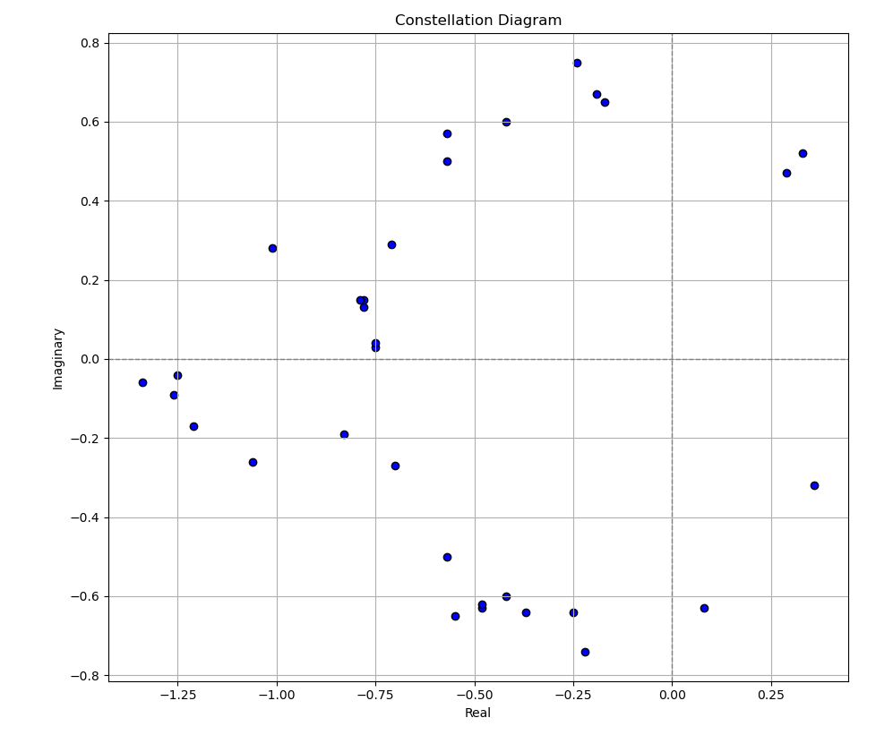
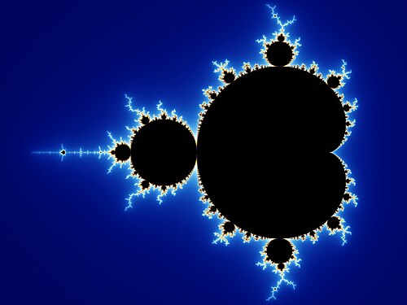

We are given a file with a series of complex numbers.
```
-1.2499999999999993-0.03999999999999925i
-0.4199999999999986+0.6000000000000011i
-0.24999999999999845-0.6399999999999997i
-1.2099999999999993-0.16999999999999926i
0.08000000000000164-0.6299999999999997i
0.3600000000000018-0.3199999999999994i
0.3300000000000018+0.520000000000001i
-0.16999999999999837+0.6500000000000011i
-0.23999999999999844+0.7500000000000012i
-0.6999999999999988-0.26999999999999935i
-0.5699999999999987+0.5700000000000011i
-0.5499999999999987-0.6499999999999997i
-0.5699999999999987-0.49999999999999956i
-0.7099999999999989+0.29000000000000087i
-0.36999999999999855-0.6399999999999997i
-0.7499999999999989+0.030000000000000755i
-1.2599999999999993-0.08999999999999925i
-1.0099999999999991+0.28000000000000086i
-1.3399999999999994-0.059999999999999255i
-0.5699999999999987+0.500000000000001i
-0.7499999999999989+0.04000000000000076i
-0.47999999999999865-0.6299999999999997i
-1.0599999999999992-0.25999999999999934i
-0.7799999999999989+0.13000000000000073i
-0.21999999999999842-0.7399999999999998i
-0.7799999999999989+0.15000000000000074i
-0.47999999999999865-0.6199999999999997i
-0.1899999999999984+0.6700000000000012i
-0.4199999999999986-0.5999999999999996i
0.29000000000000176+0.47000000000000103i
-0.829999999999999-0.18999999999999928i
-0.7899999999999989+0.15000000000000074i
```
Interesting. The challenge title mentions fractals, which are patterns that exhibit **self-similarity**; at varying levels of zoom, they can look the same. Common fractals in the complex field $\mathbb C$ are the Mandelbrot set and the Julia set. 

One thing I always love to do when I'm faced with complex numbers is to plot a constellation of them. We can do this using `matplotlib` in python.

```
import matplotlib.pyplot as plt
import numpy as np

def plot_constellation(points, title="Constellation Diagram"):
    real = [z.real for z in points]
    imag = [z.imag for z in points]

    plt.figure(figsize=(6,6))
    plt.scatter(real, imag, color='blue', edgecolors='black')
    
    plt.axhline(0, color='gray', linestyle='--', linewidth=1)
    plt.axvline(0, color='gray', linestyle='--', linewidth=1)

    plt.grid(True, which='both')
    plt.gca().set_aspect('equal', adjustable='box')
    plt.title(title)
    plt.xlabel("Real")
    plt.ylabel("Imaginary")
    plt.show()

f = open("out.txt").read().split("\n")

a = []
for i in f:
    # Python uses j as the imaginary unit instead of i
    a.append(complex(i.replace("i", "j")))

plot_constellation(a)
```

From this, we get a very intriguing result:


This is very reminiscent of the mandelbrot set. 


Note that the black part is the set, but there are still colours outside. So we know that this set of complex numbers must be related to the mandelbrot set... but where is the actual information?

### Encoding information in fractals
The mandelbrot set is defined as the recursive equation:
\\[ z_{n+1} = z_n^2 + c \\]
...where $c$ is the complex number we are testing ($c \in \mathbb C$) and $z_0 = 0$. A number is part of the mandelbrot set if the recursive equation **converges/does not diverge**. Essentially, all outputs of the recursive equation are bounded within some particular values. To test if a number diverges, we look for an output of the recursive equation such that $|z| > 2$. 

However, some numbers may diverge, but after a certain number of iterations in the recursive equation. Remember the colours on the outside of the set in the picture above? These refer to numbers that are not part of the set, but are coloured according to how fast they diverge. This is measured by the amount of iterations it takes for $|z| > 2$ to happen. For example: how long does it take for the number $c = 1.5$ to diverge?
\\[ z_1 = 0 + 1.5 \\]
\\[ z_2 = z_1^2 + 1.5 = 2.25 + 1.5 \\]
\\[ z_2 = 3.75 \\]
Thus at iteration 2 we have found $|z| > 2$. So the amount of iterations for $c=1.5$ to diverge is 2. Now, what if we try that with our complex numbers?
```py
def mandelbrot_escape_time(c):
    z = 0
    for i in range(1000): # max iterations 1000
        z = z * z + c
        if abs(z) > 2:
            return i
    # Could not encounter z > 2 in 1000 iterations
    return 1000

f = open("out.txt").read().split("\n")

a = []
for i in f:
    a.append(complex(i.replace("i", "j")))

b = []
for i in a:
    b.append(mandelbrot_escape_time(i))

print(f"{b = }")
```

```
$ python mandelbrot.py
b = [68, 97, 119, 103, 67, 84, 70, 123, 66, 101, 78, 48, 49, 116, 87, 104, 48, 67, 111, 49, 78, 51, 100, 70, 114, 64, 67, 116, 97, 76, 115, 125]
```

Very interesting! They all line up within ASCII values! Let's print out the characters.

```py
for i in b:
    print(chr(i), end="")
```

```
$ python mandelbrot.py
b = [68, 97, 119, 103, 67, 84, 70, 123, 66, 101, 78, 48, 49, 116, 87, 104, 48, 67, 111, 49, 78, 51, 100, 70, 114, 64, 67, 116, 97, 76, 115, 125]
DawgCTF{BeN01tWh0Co1N3dFr@CtaLs}
```

Flag: `DawgCTF{BeN01tWh0Co1N3dFr@CtaLs}`