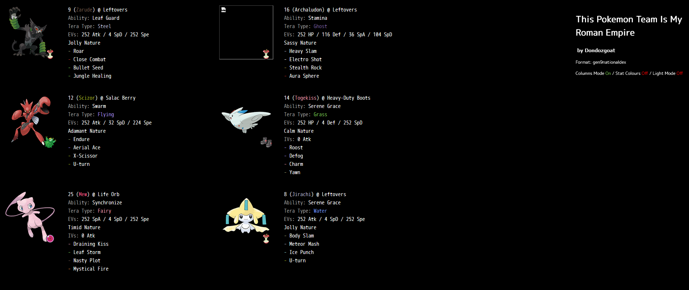

Let's check out this website.



Cool. The description said something about the movesets of the pokemon:
```
9 (Zarude) @ Leftovers  
Ability: Leaf Guard  
Tera Type: Steel  
EVs: 252 Atk / 4 SpD / 252 Spe  
Jolly Nature  
- Roar  
- Close Combat  
- Bullet Seed  
- Jungle Healing  
```

The challenge title also hints "Roman Empire". Time for a shot in the dark.

Taking that as a caesar shift, what if we tried taking the first letter of each move, and reverse caesar shifting by the level of the pokemon? e.g.
```
9 (Zarude) @ Leftovers  
Ability: Leaf Guard  
Tera Type: Steel  
EVs: 252 Atk / 4 SpD / 252 Spe  
Jolly Nature  
- Roar -> R
- Close Combat -> C  
- Bullet Seed -> B
- Jungle Healing -> J
```

We would take the corresponding ciphertext is `RCBJ`, and the shift as 9. So let's reverse it. 
\\[ \operatorname{caesar}_{-9}(\mathrm{RCBJ}) = \mathrm{ITSA} \\]

Next one:
```
16 (Archaludon) @ Leftovers  
Ability: Stamina  
Tera Type: Ghost  
EVs: 252 HP / 116 Def / 36 SpA / 104 SpD  
Sassy Nature  
- Heavy Slam  
- Electro Shot  
- Stealth Rock  
- Aura Sphere  
```
\\[ \operatorname{caesar}_{-16}(\mathrm{HESA}) = \mathrm{ROCK} \\]

We keep doing this, until we reach the last pokemon. Here is the list of ciphers with their corresponding shifts.
```
RCBJ : 09 -> ITSA
HESA : 16 -> ROCK
EAXU : 12 -> SOLI
RDCY : 14 -> DPOK
DLNM : 25 -> EMON
BMIU : 08 -> TEAM
```

Flag: `ITSAROCKSOLIDPOKEMONTEAM`