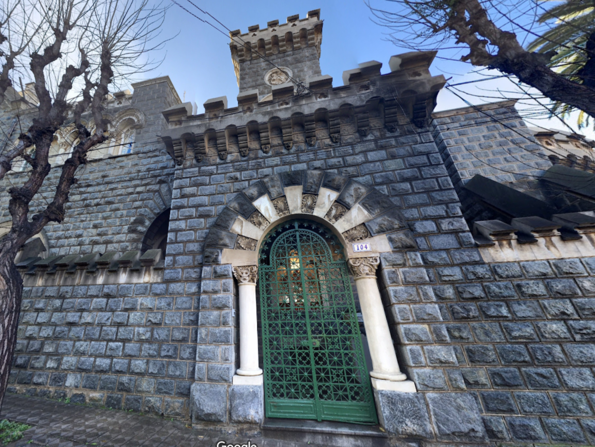
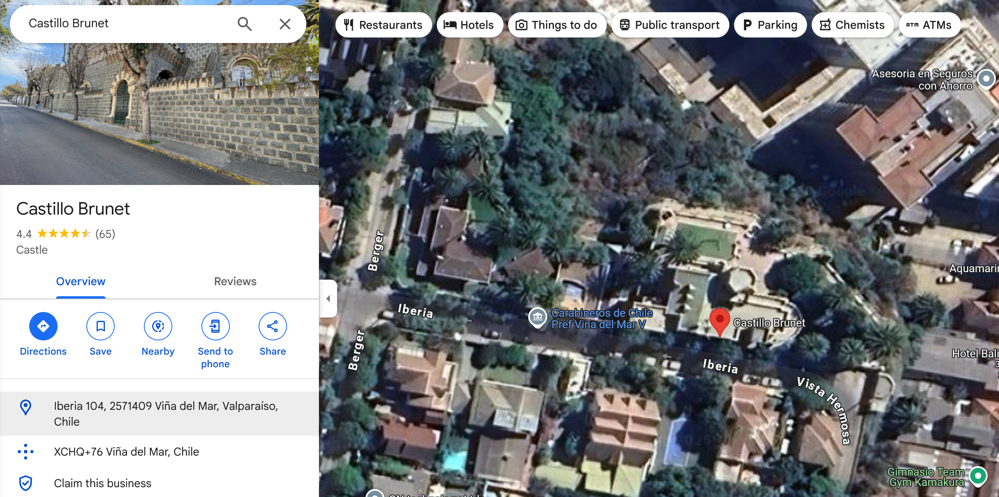

## The Ancient Citadel

Along with the flavourtext, we are given the following image: 



As the image of this castle is pretty unique, I know its going to work well on [Google Images](https://images.google.com/). Nonetheless, I go through the flavourtext (and the image) and pick out a few key details: 

- "in the southern kingdoms of Chile" --> the image of the castle we have been given is somewhere in Chile, so I can add this as a location to my [Google Images](https://images.google.com/) search if needed. 
- On the image, we are provided with a house number: `104`, so that's something to consider as well. 

Once again, I pop the image into [Google Images](https://images.google.com/) for a reverse image search, with the keyword `Chile` and I get an automated response from Google's AI engine:

```Brunet Castle, located in Viña del Mar, Chile, is depicted in the image. The castle, constructed from gray stone, features a castellated roofline, a prominent central tower, and an arched entrance with a green metal gate. The number 104 is visible above the entrance. The building's architecture suggests a historic or possibly neo-Gothic style, with details like the textured stone walls and decorative elements contributing to its appearance. The castle is situated in an urban environment, as indicated by the surrounding trees and the presence of a street-level view. The image appears to be taken during daylight hours under natural lighting, capturing the details of the castle's facade.```

Ok, so we are given a place called Brunet Castle, lets give that a search on [Google Maps](https://www.google.com/maps). Google maps returns the following [location](https://www.google.com/maps/place/Castillo+Brunet/@-33.0217628,-71.5645149,768m/data=!3m2!1e3!4b1!4m6!3m5!1s0x9689ddffec4ef26b:0xa3e4dba05fa76032!8m2!3d-33.0217628!4d-71.56194!16s%2Fg%2F120t47_3?entry=ttu&g_ep=EgoyMDI1MDMyNC4wIKXMDSoASAFQAw%3D%3D)





In the Google Maps data, we are given the following address: `Iberia 104, 2571409 Viña del Mar, Valparaíso, Chile`. Hold on, this matches our flag format! Lets format our address properly to get the flag. 

Flag: `HTB{Iberia_104_2571409_Viña_del_Mar_Valparaíso}`