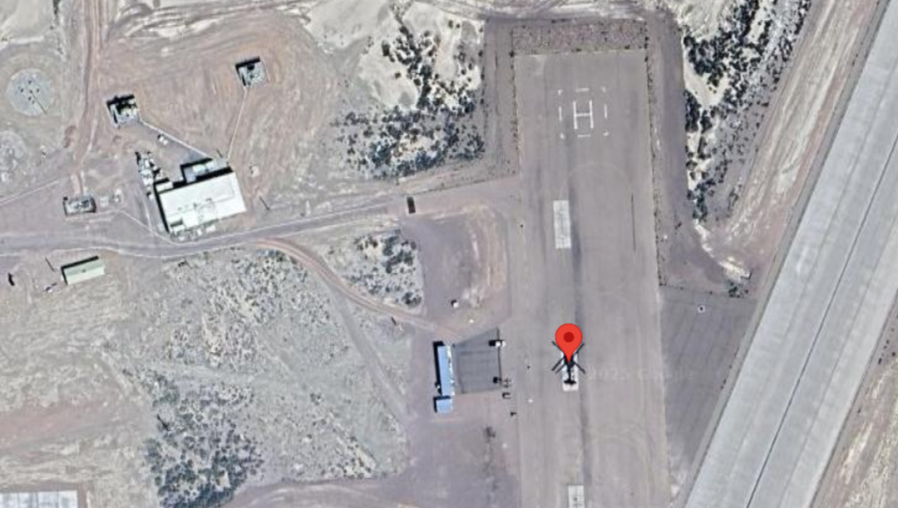
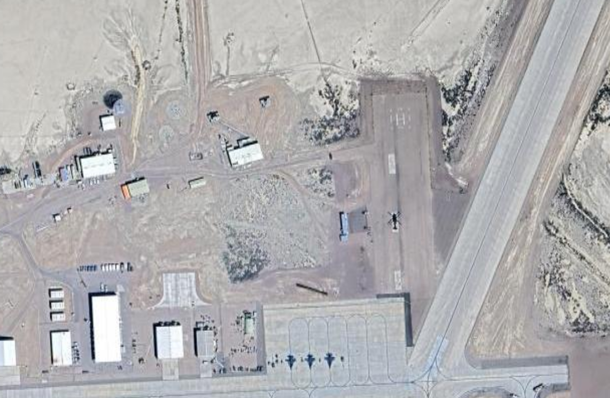

## The Mechanical Bird's Nest

Today on our OSINT challenges, along with the above flavourtext, we are given the following image: 

From both the flavourtext and the image, I pick up the following details: 
- Our location is in a desert.
- Its in a "fortress", so most likely a well protected location.
- The flag format uses Latitude and Longitude to three decimal places. 
- The "pin" tells me that its a [Google Maps](https://www.google.com/maps) location, so any metadata regarding location is kinda gonna be useless. 

After noting this down, the first thing I usually do is a reverse image search using [Google Images](https://images.google.com/). Instantly, the first hit that I get is for Area 51. So, I hop onto [Google Maps](https://www.google.com/maps) and search up Area 51. Its in the middle of the desert, so it matches our first dot point. It also matches our fortress hint, as Area 51 is famously a bit difficult to get into to say the least.

### Google Maps time!

Now that I know the rough location of our image, I hop onto [Google Maps](https://www.google.com/maps) and start having a bit of a look around. I know that I'm looking for a helipad, but I also take note of the small building to the left of the landing pad. After looking around for a bit, I get the following visual match:

Here's the actual [Google Maps Pin](https://www.google.com/maps/place/Area+51,+NV,+USA/@37.2474748,-115.8129848,209m/data=!3m1!1e3!4m6!3m5!1s0x80b81baaba3e8c81:0x970427e38e6237ae!8m2!3d37.2430548!4d-115.7930198!16zL20vMHlqcQ?entry=ttu&g_ep=EgoyMDI1MDMyNC4wIKXMDSoASAFQAw%3D%3D) if anyone wants to have a look. 

Now I just have to pop the pin on the helicopter and we've got the flag!

Flag: `HTB{37.247_-115.812}`

