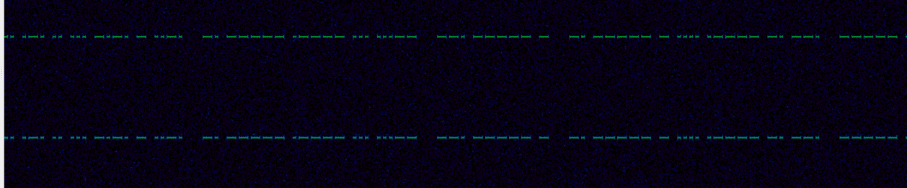

We are given an `.iq` file. For those new to radio, this stands for in-phase and quadrature data, and is commonly used in storage of radio transmission and such due to its compact and efficient "format" (it's really just a big stream of bytes).

The title of the challenge suggests morse code. Let's open the file in a tool such as Inspectrum which can open and interpret `.iq` data.



Sure enough, there it is! All we need to do is transform this back into readable text. Let's first convert it to something in text, then pass it to a morse decoder.

```
. means a short, _ means a long. 
/ is used to separate letters for easier reading. 

.. / ._. / .. / ... / _._. / _ / .._. / _. / _____ / .____ / ... / ...__ / __. / _____ / _ / _. / _____ / _ / .... / .____ / _. / __. / _____ / _. / __ / _.__ / __ / _____ / ._. / ... / .
```

Using a decoder such as one like [this](https://morsecode.world/international/translator.html), we get the flag!

Flag: `irisctf{n01s3_g0t_n0th1ng_0n_my_m0rse}`
