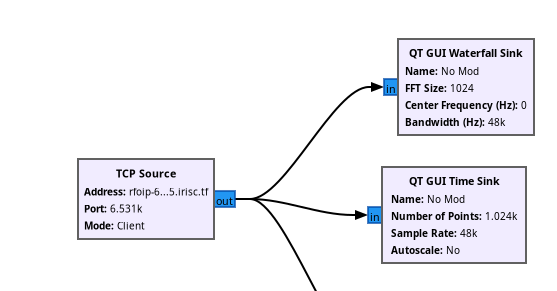
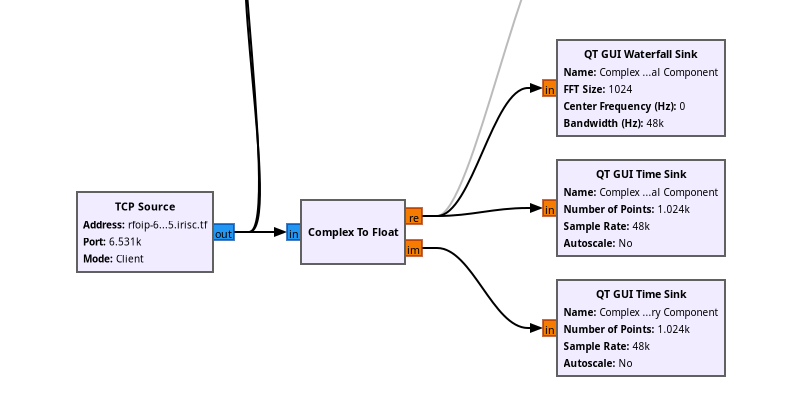
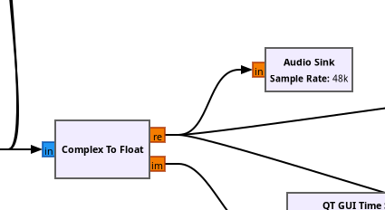

The second of the radio challenges in IrisCTF 2025. For this, we're given a TCP source of IQ data instead, so we'll have to switch up our toolkit. A very versatile radio tool is GNU radio + GNU radio companion, and from this we can create a process to receive data from the TCP source.

Make sure your TCP source is set to `client` mode! By default, it is set to `server` mode, where it will transmit data instead of receiving. Just some terminology to clear up here as well: 
- Sinks refer to any output device. It can be an audio sink, or a time-graph sink, or a file sink (write to file).
- A waterfall is a graph that lets you visualise frequencies being received. If you know what a spectrogram looks like, it's like that.
- A time sink is a graph that basically just lets us view the signal being received or transmitted, like an oscilloscope.
- Radio often uses complex numbers, which are numbers in the form $\alpha + \beta i$, where $i$ is the imaginary unit. We call $\alpha$ the "real component" and $\beta$ the "imaginary component".
- The colour codes on the chart denote the type of data being sent through. The common ones are blue for complex, and red for float.

Anyways, we are assuming we are meant to be listening for human speech. A good place to start is to check the time and audio sinks for the real and imaginary components, which we can do via the `Complex to Float` block in GRC, and then connect the outputs to their own time sinks.

Checking the time sinks for our real and imaginary components, we can see that the real component is picking up some transmission! The imaginary component has not picked up anything. Let's plug the real component to an audio sink and listen in!

In the real component, we can hear our flag being transmitted to us!

Flag: `irisctf{welcome_to_iris_radio_enjoy_surfing_the_waves}`
