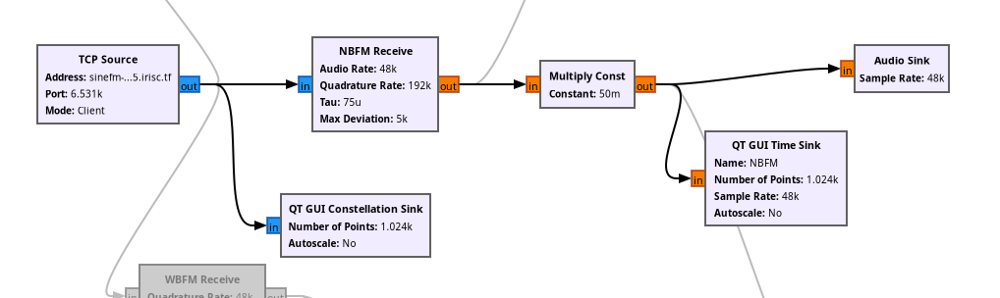

**Note: This writeup uses software and terms from the [RFoIP writeup](25-irisctf-rfoip), recommended you read that first if you are new to radio.**

Following from the same principle as before, we connect to the TCP source and listen in, analysing the incoming signal. The signal here is compressing and rarefacting very rapidly, which is a telltal sign of an FM encoded signal. FM stands for frequency modulation and is a common technique used to transmit data over radio. 

What this means is that the encoded message will have a constant amplitude, with varying frequency. This is exactly what we see here and GRC has a decoder for this built into it. We'll use the `NBFM Receive` blocks and the `Multiply Const` blocks are to increase the ampliude of the signal so we can actually hear. Finally connect it to an `Audio Sink` to be able to actually hear the decoded signal.

The NBFM receive blocks take in complex FM encoded signals and spit out float data, so we can plug this float data into an amplifier and to our audio sink.

From this flow chart, we can hear the flag on the radio.

Flag: `irisctf{grc_is_great_for_simple_narrowband_modulation}`
