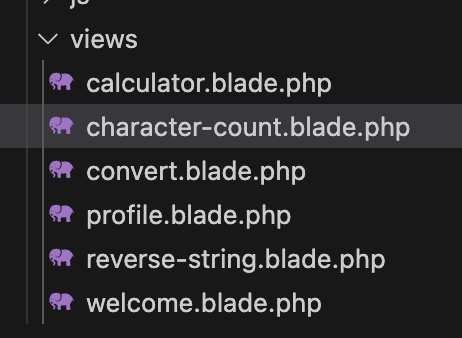

> Original Writeup on [seall.dev](https://seall.dev/posts/knightctf2025#exceeding-knight)

This was an open source web challenge and we were given a sizeable PHP application.

The flag is stored inside the `.env` so we need to find a way to dump the environment.

This app used Laravel and had some applications: a calculator, a unit conversion app, a string reverser, and a character counter. There was also a welcome page and a profile page which had no functionality.



Looking through this app there is... nothing of interest initally. They seem to have covered all the possible bugs.

```php
<?php

namespace App\Http\Controllers;

use Illuminate\Http\Request;

class CalculatorController extends Controller
{
    public function index()
    {
        return view('calculator');
    }

    public function calculate(Request $request)
    {
        $request->validate([
            'num1' => 'required|numeric',
            'num2' => 'required|numeric',
            'operation' => 'required|in:add,sub,mul,div',
        ]);

        $num1 = $request->input('num1');
        $num2 = $request->input('num2');
        $operation = $request->input('operation');
        $limit = env('MAX_CALC_LIMIT', 100000);

        if ($num1 > $limit || $num2 > $limit) {
            throw new \Exception("You have hit the calculation limit set in the .env file.");
        }

        $result = match ($operation) {
            'add' => $num1 + $num2,
            'sub' => $num1 - $num2,
            'mul' => $num1 * $num2,
            'div' => $num2 != 0 ? $num1 / $num2 : throw new \Exception("Division by zero is not allowed."),
        };

        return view('calculator', ['result' => $result]);
    }
}
```

The calculator for example has max int limits and 0 divison checks to stop errors, no reflections of dangerous characters (same as elsewhere).

After looking through the application for a long time, we noticied the `app/Exceptions/Handler.php`

```php
<?php

namespace App\Exceptions;

use Illuminate\Foundation\Exceptions\Handler as ExceptionHandler;
use Throwable;

class Handler extends ExceptionHandler {
    protected $dontReport = [];
    protected $dontFlash = ['current_password', 'password', 'password_confirmation'];

    public function register() {
        $this->reportable(function (Throwable $e) {
            //
        });
    }

    public function render($request, Throwable $e) {
        // for debugging
        if (str_contains($e->getMessage(), 'set in the .env file')) {
            $envContent = file_get_contents(base_path('.env'));
            $e = new \Exception($e->getMessage() . "\n\n" .
                "You set a limit on .env and for better debugging here is the content of .env:\n\n" . $envContent);
        }

        return parent::render($request, $e);
    }
}
```

If it hit's an error, the `.env` is dumped. So we just need to trigger some integer overflow.

On the calculator app we calculate `1+11111111111111111111` and we get the flag in the `.env` printout.

Flag: `KCTF{_Y0U_sH0UlD_re4D_m0r3_Cod3_}`
