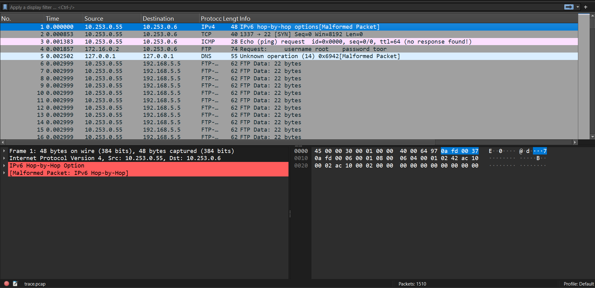

With the shark1.pcapng provided within the [picoCTF site](https://play.picoctf.org/practice/challenge/362?page=1&search=pcap), the pcap is opened within wireshark. The packet list displays a large number of intercepted traffics, which can be seen below. 

As seenable above, viewing the fourth packet, it particularly stands out with the username and password shared for an user. 

Filtering using the `tcp.stream eq 1` within the display filter, the TCP steam following the fourth packet can be seen, which is packet 507. Viewing the decoded packet content in the packet bytes section, the flag can be seen.
```
ER@
P picoCTF{P64P_4N4L7S1S_SU55355FUL_f621fa37}
```