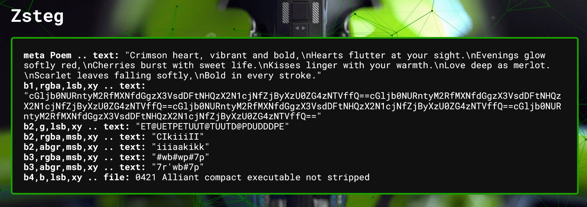

We start with a `red.png`, viewing the contents is just the colour red...


I check the image with `exiftool` and there is a Poem:
```bash
$ exiftool red.png
ExifTool Version Number         : 13.10
...
Poem                            : Crimson heart, vibrant and bold,.Hearts flutter at your sight..Evenings glow softly red,.Cherries burst with sweet life..Kisses linger with your warmth..Love deep as merlot..Scarlet leaves falling softly,.Bold in every stroke.
...
```

I put the image into AperiSolve which automatically tries steganography tools and visually modifying the image as well as extracting colour channels.

The output for Zsteg is of interest!


There is Base64! Let's decode this string (You can use CyberChef, Dcode.fr, etc, etc... I use the `base64` utility) The string repeats itself, generally `==` is the end of a Base64 string so let's split it there:
```
$ echo "cGljb0NURntyM2RfMXNfdGgzX3VsdDFtNHQzX2N1cjNfZjByXzU0ZG4zNTVffQ==" | base64 0d
picoCTF{r3d_1s_th3_ult1m4t3_cur3_f0r_54dn355_}
```

Flag: `picoCTF{r3d_1s_th3_ult1m4t3_cur3_f0r_54dn355_}`